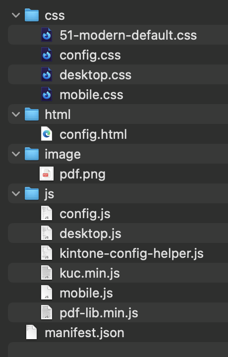
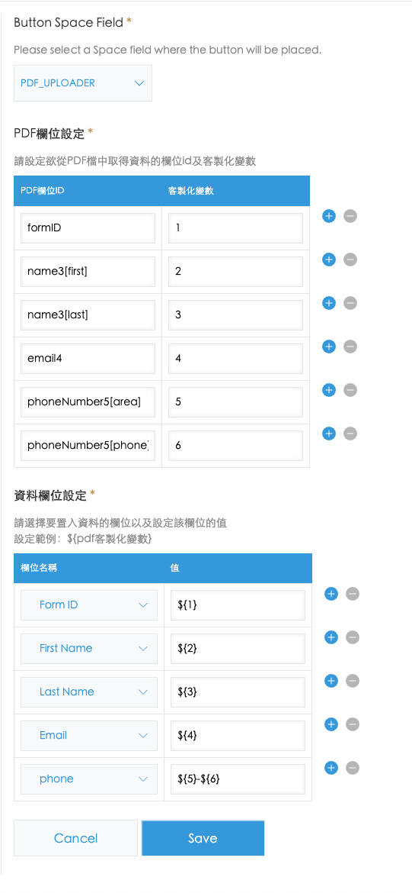
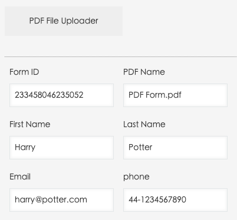

# PDF Uploader

## 檔案配置



---

## 外掛說明

上傳pdf檔以取得pdf的欄位資料，並將資料置入record欄位




---

## Icon來源

https://www.flaticon.com/free-icon/pdf_4208479

---

## 打包

```bash
kintone-plugin-packer src 
```
或是使用此網站:

[https://plugin-packer.kintone.dev/](https://plugin-packer.kintone.dev/)